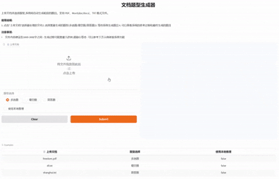
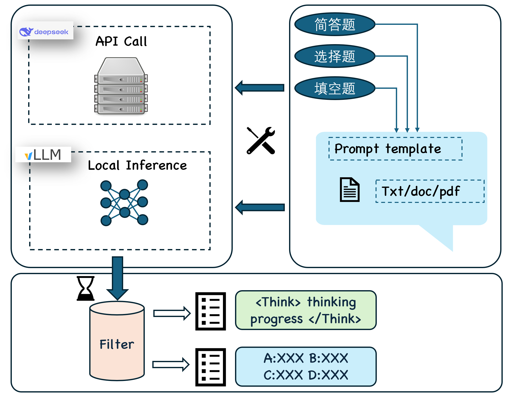

## 基于DeepSeek R1的问题生成


## 作者
<div align="center">

闫泽轩 | 张延 | 李宸枢

</div>

## 框架

本项目为“基于大语言模型的问题生成”的大学生创新训练计划，旨在构建一个利用大语言模型（LLM）实现教育场景中自动出题和作业评价的智能系统。项目从问题生成、推理大模型、参数高效微调和强化学习等方面展开研究。我们利用DeepSeek系列模型、LoRA微调方法、SimPO强化学习机制，并结合Gradio前端实现了一个完整的自动出题平台，支持pdf/doc/txt格式的上传，并生成多种题型（选择题、填空题、简答题）。通过对SQuAD数据集的处理和三种不同模型（满血模型、蒸馏模型、微调模型）的案例研究，验证了微调后模型在生成质量和效率上的优势。项目收获了丰富的实践经验，掌握了主流的大模型推理和微调技术，未来可扩展至更多数据集和任务场景，推动教育智能化发展。

## 使用方法
> apikey设置:config下新建json文件
{
    "api_key":"xxxx"
}
> 
``` bash
git clone git@github.com:yuriYanZeXuan/BigCreation.git
conda create -n llmfac python=3.11
conda activate llmfac
pip install -r requirements.txt
! 后端vllm推理运行
! source local_run.sh
! 后端api运行
python app.py
```
## 环境要求
<details>
<summary>环境要求</summary>

### 基础环境
- conda: 24.11.1
- cuda: 12.6
- glibc: 2.35

### 核心依赖
- transformers: >=4.41.2,<=4.51.0,!=4.46.*,!=4.47.*,!=4.48.0
- datasets: >=2.16.0,<=3.4.1
- accelerate: >=0.34.0,<=1.5.2
- peft: >=0.14.0,<=0.15.0
- trl: >=0.8.6,<=0.9.6
- tokenizers: >=0.19.0,<=0.21.0
- gradio: >=4.38.0,<=5.21.0

### 数据处理
- pandas: >=2.0.0
- scipy
- numpy: <2.0.0
- matplotlib: >=3.7.0

### 模型相关
- einops
- sentencepiece
- tiktoken
- bitsandbytes: >=0.37.0

### Web服务
- uvicorn
- fastapi
- sse-starlette
- pydantic: <=2.10.6

### 工具库
- protobuf
- fire
- packaging
- pyyaml
- av
- librosa
- tyro: <0.9.0

</details>


## Acknowledgement

This repo benefits from [llama-factory](https://github.com/hiyouga/LLaMA-Factory) [PEFT](https://github.com/huggingface/peft), [TRL](https://github.com/huggingface/trl), [QLoRA](https://github.com/artidoro/qlora) and [FastChat](https://github.com/lm-sys/FastChat). Thanks for their wonderful works.
image.png